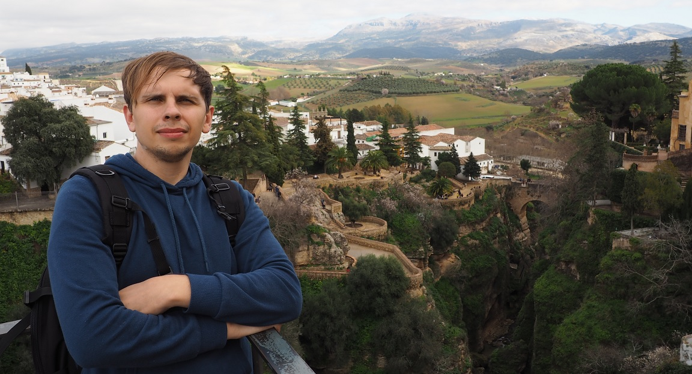

# Konstantin Sikorskii

> junior frontend-developer



## CONTACTS

- **e-mail:** [apelsin1987@gmail.com](mailto:apelsin1987@gmail.com)
- **phone:** [+34641173185](tel:+34641173185)
- **telegram:** [kapelsin](https://t.me/kapelsin)
- **discord:** [konstantin.si](https://discordapp.com/users/1152934307418099853/)
- **github:** [Apelsin1987](https://github.com/Apelsin1987)
- **address:** [Spain, Benalmadena, Malaga](https://www.google.com/maps/place/benalmadena)

## ABOUT ME

I'm from Russia, but now I live in Spain. After graduating from university in 2010, I started working and continue to this day as a 1C programmer. At the moment, my priority is the successful completion of front-end development courses followed by employment in a European company. Global goal: to become a senior full stack developer.

## SKILLS

- 1C
  - development
  - queries to database
  - administration
  - integrations with other systems
  - EDT
- Frontend
  - HTML
  - CSS
  - JavaScript
  - TypeScript
- Backend
  - NodeJS
- VS Code
- GIT
- GitHub
- RabbitMQ
- Azure devops
- Jira
- Confluence

## CODE EXAMPLE

- My **CodeWars** profile:
  [Konstantin Si](https://www.codewars.com/users/rsschool_1dd3582d24dde48f)
- Task:
  [4kyu CodeWars task: Undo / Redo](https://www.codewars.com/kata/531489f2bb244a5b9f00077e/javascript)
- Solution:

```
   function undoRedo(object) {
        const copy = { ...object }
            return {
                set: function(key, value) {
            copy.prevState = { ...copy };
            delete copy['nextState'];
            object[key] = value;
            copy[key] = value;
            },
                get: function(key) {
            return object[key];
            },
                del: function(key) {
            copy.prevState = { ...copy };
            delete copy['nextState'];
            delete object[key];
            delete copy[key];
            },
                undo: function() {
            const deleteProperties = [];
            Object.keys(copy).forEach((key) => {
                if (!copy.prevState.hasOwnProperty(key)) deleteProperties.push(key);
            });

            copy.nextState = { ...copy };
            delete copy.prevState.nextState;
            Object.assign(object, copy.prevState);
            Object.assign(copy, copy.prevState);

            deleteProperties.forEach((key) => {
                delete object[key];
                if (key !== 'nextState') {
                delete copy[key];
                }
            });

            delete object.nextState;
            delete object.prevState;
            },
                redo: function() {
            const deleteProperties = [];
            Object.keys(copy).forEach((key) => {
                if (!copy.nextState.hasOwnProperty(key)) deleteProperties.push(key);
            });

            Object.assign(object, copy.nextState);
            Object.assign(copy, copy.nextState);

            deleteProperties.forEach((key) => {
                delete object[key];
                delete copy[key];
            });
            delete object.nextState;
            delete object.prevState;
            }, ...object
        };

    }
```

## EXPERIENCE

### 1C Developer

companies: _Gazprom Mezhregiongaz, Audit NT, OCS_

> 2010 - Present

### _Projects:_

**[Rolling Scope School](https://rs.school/)**

- [Currículum Vitae](https://apelsin1987.github.io/rsschool-cv/)
- [Page "Coffee House"](https://rolling-scopes-school.github.io/apelsin1987-JSFE2023Q4/coffee-house)
- [Page "Christmas Shop"](https://rolling-scopes-school.github.io/apelsin1987-JSFE2024Q4/christmas-shop/home.html)
- [Game "Hangman"](https://rolling-scopes-school.github.io/apelsin1987-JSFE2023Q4/hangman)
- [Game "Nonograms"](https://rolling-scopes-school.github.io/apelsin1987-JSFE2023Q4/nonograms)
- [Game "Simon Says"](https://rolling-scopes-school.github.io/apelsin1987-JSFE2024Q4/simon-says/)

## EDUCATION

### Specialist, Engineer

**Taganrog Technological Institute of the Southern Federal University**

> 2005 - 2010

### 1C Professional

**First BIT**

> 2013

## LANGUAGES

- russian
- english A2
- spanish A2
